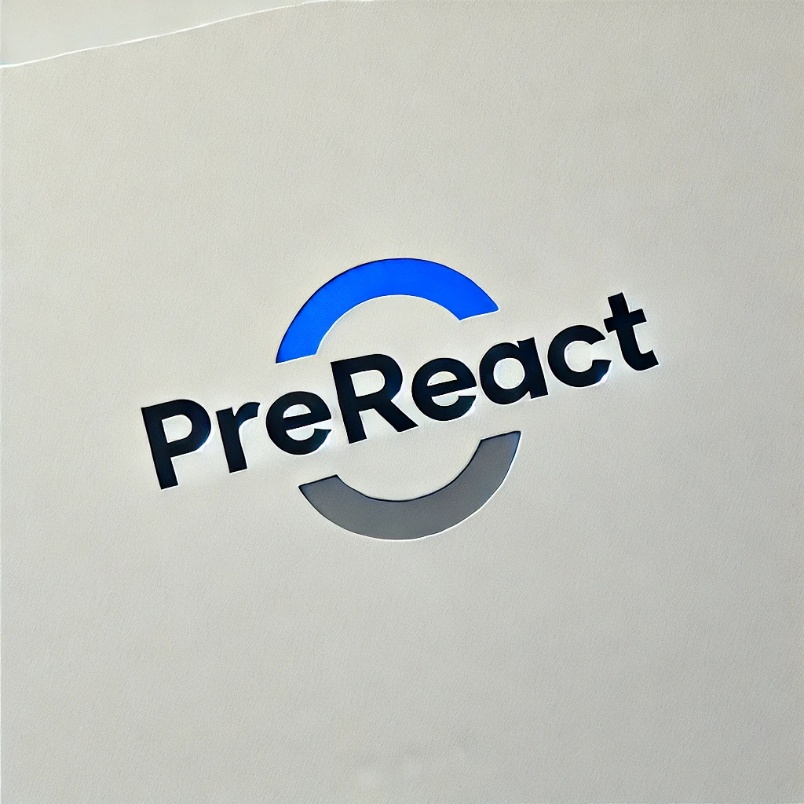

# Projektname




## Übersicht
Dies ist eine kurze Beschreibung des Projekts. Es besteht aus drei Hauptunterprojekten, die zusammenarbeiten, um eine umfassende Lösung für [Problemstellung] zu bieten.

---

## Unterprojekte

### 1. Unterprojekt 1: Name
- **Ziel:** Kurzbeschreibung des Ziels dieses Unterprojekts.
- **Features:**
  - Feature 1
  - Feature 2
  - Feature 3
- **Technologien:** Verwendete Technologien (z. B. Python, JavaScript, etc.)
- **Status:** [In Entwicklung/Fertiggestellt]

---

### 2. Unterprojekt 2: Name
- **Ziel:** Kurzbeschreibung des Ziels dieses Unterprojekts.
- **Features:**
  - Feature 1
  - Feature 2
  - Feature 3
- **Technologien:** Verwendete Technologien (z. B. C++, React, etc.)
- **Status:** [In Entwicklung/Fertiggestellt]

---

### 3. Unterprojekt 3: Name
- **Ziel:** Kurzbeschreibung des Ziels dieses Unterprojekts.
- **Features:**
  - Feature 1
  - Feature 2
  - Feature 3
- **Technologien:** Verwendete Technologien (z. B. Rust, Node.js, etc.)
- **Status:** [In Entwicklung/Fertiggestellt]

---

## Installation
1. Clone das Repository:
   ```bash
   git clone https://github.com/username/projektname.git
